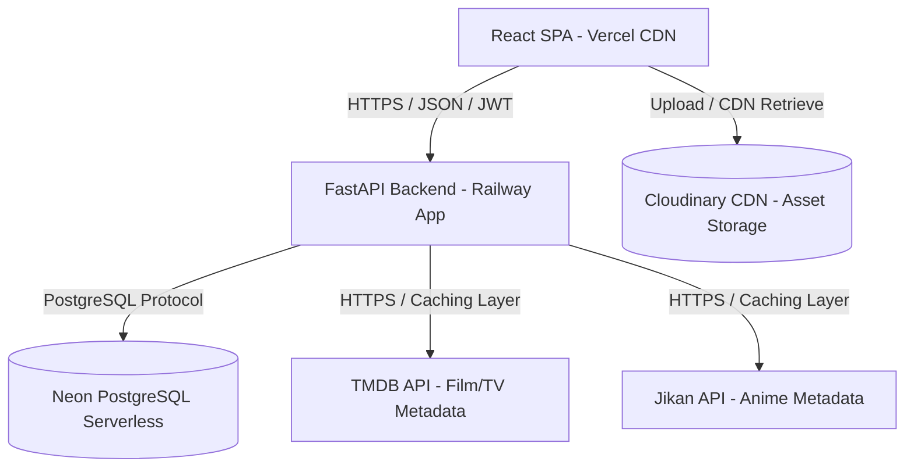

# CineVault: Software Architecture Specification

This document serves as the official technical architecture blueprint for **CineVault**—a premium, production-grade SaaS entertainment tracking platform. It defines the systems topology, folder structures, state boundaries, data flow patterns, security posture, and scaling pathways.

---

## 1. High-Level Architecture

CineVault is built on a decoupled, client-server architecture designed for high availability, low latency, and secure data isolation.



### Communication & Data Flow
*   **Frontend Client**: React Single Page Application (SPA) compiled via Vite and served globally through Vercel's Edge Network CDN. Uses HTTPS for all traffic.
*   **Backend Server**: FastAPI (Python) running async workers, deployed on Railway. Exposes a stateless RESTful JSON API.
*   **Database Layer**: Neon Serverless PostgreSQL. Integrates database connection pooling to handle scale bursts and serverless cold starts.
*   **Media Storage**: Cloudinary holds user-uploaded avatars and collection cover art. The frontend performs signed direct uploads to Cloudinary, reducing backend bandwidth loads.
*   **External Metadata**: Media searches query the backend, which acts as a proxy for TMDB (movies/TV) and Jikan (anime). The backend normalizes the payloads and stores static details in PostgreSQL/Redis caches to comply with third-party rate limits.
*   **Security & Auth**: Stateful token verification. Client sessions are managed via JWT access and refresh tokens.

---

## 2. Folder Architecture

The frontend follows a **Feature-First Architecture** inside `src/`. This modular structure partitions domains to prevent files from growing uncontrollably.

```
src/
├── api/          # Global API client configurations, Axios interceptors, base fetchers
├── assets/       # Global static assets (SVG logos, splash illustrations)
├── components/   # Reusable global layout shells (e.g. AppWrapper, Header, Footer)
│   └── ui/       # shadcn/ui visual primitive components (buttons, dialogs, inputs)
├── config/       # Global environment parsing, constant settings, route declarations
├── constants/    # Static system parameters (languages, rating scales, genres)
├── features/     # Feature modules (Feature-First groupings)
├── hooks/        # Global utility hooks (useDebounce, useMediaQuery, useIntersection)
├── layouts/      # Layout wrapper templates (DashboardLayout, AuthLayout, SettingsLayout)
├── lib/          # Third-party library wrappers (Tailwind merger, QueryClient configuration)
├── providers/    # Global React Context providers (ThemeProvider, QueryProvider)
├── routes/       # React Router route trees, route loaders, and page-level routes map
├── shared/       # Reusable, feature-independent components, hooks, and types
├── store/        # Core global Zustand stores (global UI elements, auth profile state)
├── styles/       # Tailwind directive files and css token files (globals.css)
├── types/        # Global TypeScript structures, shared domain definitions
└── utils/        # Pure utility functions (formatting dates, calculating watch statistics)
```

---

## 3. Feature Module Architecture

Inside `src/features/[feature_name]/`, code is divided into self-contained sub-folders. Features include `auth/`, `dashboard/`, `search/`, `watchlist/`, `collections/`, and `analytics/`.

### Structure of a Feature Module
```
features/[feature_name]/
├── components/   # UI elements specific ONLY to this feature module
├── pages/        # Route entry-point page containers for the feature
├── hooks/        # Feature-specific state machines or custom event controllers
├── services/     # Feature endpoints, Axios calls, and React Query custom hooks
├── types/        # Domain-specific TypeScript declarations
└── utils/        # Helper logic unique to this feature's domain
```

### Why This Scalability Pattern Works
*   **Strict Encapsulation**: A feature's internal components cannot import from another feature's internal folder. This prevents spaghetti code and circular imports.
*   **Refactor/Deletion Safety**: If a feature is deprecated, deleting the root `features/[feature_name]/` directory cleans up the entire module, leaving no orphan code behind.
*   **Reduced Context Switching**: Developers working on the watchlist feature find all relevant layout logic, query fetches, and types in one place.

---

## 4. State Management Matrix

State is categorized by lifespan and synchronization scope. Misusing state layers degrades performance.

| State Layer | Tool / Tech | Scope | Example Use Case |
| :--- | :--- | :--- | :--- |
| **Local UI State** | React `useState` | Single Component Lifecycle | Toggle state of a sidebar, input text fields, hover details |
| **Shared Layout State** | Zustand | Global Synchronous UI | Global modal queues, navigation collapse states, theme selections |
| **Server State** | TanStack Query | Global Asynchronous Server Sync | Fetching watch history, media detail queries, list updates |
| **Scoped Dependency** | React Context | Component Tree Scope | Form validation contexts (React Hook Form), localized theme injectors |

---

## 5. API Layer & Request Flow

The API layer is built on **Axios** and acts as the gatekeeper for all network traffic.

```
React Component ──> TanStack Query hook ──> Service Call ──> Custom Axios Instance (with Interceptors) ──> Backend Server
```

### Client Architecture Details
*   **Base Configuration**: Instantiated with standard headers, JSON parsing, a `10,000ms` timeout, and credentials support (`withCredentials: true`) to enable secure Cookie transmission.
*   **Request Interceptor**: Synchronously intercepts outgoing requests. If a JWT access token is present in memory, it appends `Authorization: Bearer <token>` to the headers.
*   **Response Interceptor (Auth & Recovery)**:
    *   Listens for `401 Unauthorized` responses.
    *   If a `401` occurs, it pauses subsequent API requests, triggers a silent refresh POST to `/api/v1/auth/refresh` (sending the HttpOnly Refresh Token), retrieves a new Access Token, and replays all paused requests.
    *   If the refresh call fails, it clears local credentials and routes the user to the login screen.
*   **Retries**: TanStack Query automatically retries failed `GET` requests 3 times with exponential backoff. Dangerous mutation requests (`POST`, `PUT`, `DELETE`) are never auto-retried.
*   **Versioning**: Configured via base paths: `/api/v1/`.

---

## 6. Authentication Architecture

CineVault uses a **Dual-Token JWT Strategy** to balance session security and UX convenience.

```
Sign In ──> Server sets HttpOnly Cookie (Refresh) + returns JSON payload (Access Token)
Access Token (in-memory) ──> Used for secure API endpoints
Expiry ──> Client interceptor requests new Access Token using HttpOnly Cookie
Sign Out ──> Calls logout endpoint (revokes Refresh Token) + flushes in-memory Access Token
```

### Security Details
*   **Access Token**: Short-lived (15 minutes). Held strictly in client memory. Never written to LocalStorage (preventing XSS access).
*   **Refresh Token**: Long-lived (7 days). Stored in a secure, `HttpOnly`, `SameSite=Strict`, `Secure` cookie. Script access is blocked.
*   **Protected Routes**: Enforced via React Router loaders. If no credentials are in memory, the client executes a silent refresh verify before deciding to load the layout or redirect.
*   **Google OAuth**: Future setup will use a backend exchange endpoint. The client fetches a short code from Google, submits it to `/auth/google`, and receives the standard JWT payload.

---

## 7. Database Entity Relationships

The schema is normalized to guarantee data consistency.

*   **Users**: Primary entity. Has a One-to-Many relationship with `WatchHistory`, `Watchlist`, `Reviews`, `Collections`, and `Notifications`.
*   **Media**: Represents movies, TV shows, anime, etc. Uses a polymorphic metadata structure. Has a One-to-Many relationship with `WatchHistory`, `Watchlist`, and `Reviews`.
*   **WatchHistory**: Records individual watch events (e.g. TV show episode tracked, movie watched, date of consumption). Links `Users` and `Media`.
*   **Watchlist**: Tracks user queue preferences (Status: Plan-to-watch, Watching, Completed, Dropped). Links `Users` and `Media`.
*   **Reviews**: Contains rating numbers (1-10) and user written reviews. Linked to a single `User` and `Media`.
*   **Collections**: Custom lists created by users (e.g. "Favorite Studio Ghibli Movies"). Has a One-to-Many relationship with `CollectionsMedia` (junction table linking to `Media`).
*   **Notifications**: System events, episode reminders, data sync summaries linked to a specific `User`.
*   **Statistics**: Aggregated statistics updated asynchronously by background workers (total runtime, genre breakdown, format ratios). Linked One-to-One with `Users`.

---

## 8. External Integrations

*   **TMDB API (The Movie Database)**: Source for Movies, TV Shows, Documentaries, and K-Dramas. Exposes poster paths, release calendars, cast information, and crew metadata.
*   **Jikan API (Unofficial MyAnimeList API)**: Source for Anime, seasonal schedules, episodes, and studios.
*   **Cloudinary SDK**: Cloud storage for profile avatars and collection cover art. Upload processes use signed tokens generated by the backend, bypassing direct API-key exposure.

---

## 9. Caching Strategy

Performance is optimized through layered caches.

*   **Browser HTTP Cache**: Static assets (fonts, icons, compiled JS/CSS) serve long-duration immutable cache headers (`Cache-Control: public, max-age=31536000, immutable`).
*   **TanStack Query Cache**:
    *   `staleTime` is set globally to `5 minutes` for content lists, and `24 hours` for static metadata (like movie details).
    *   `gcTime` (Garbage Collection Time) is set to `10 minutes` to clean up memory of unmounted views.
*   **Offline Local Cache**: User's library index and active watchlists are stored in `IndexedDB` (via React Query's persist plugins).
*   **Image Cache**: Served through CDN nodes (Vercel edge for layout graphics, Cloudinary/TMDB/Jikan CDNs for media covers) with local browser cache directives.

---

## 10. Offline-First Synchronization

CineVault remains functional when disconnected.

1.  **Read Path**: When loading watchlists, the client fetches from the internal `IndexedDB` store first, rendering the list instantly. An asynchronous network query runs in the background. If successful, the database updates the view and updates the local cache.
2.  **Write Path**: If the network is down, mutations (e.g., ticking a TV episode watched) fail over to an **Offline Queue** in LocalStorage. The local UI state updates immediately to keep the interface responsive.
3.  **Background Sync**: The browser registers a network monitor. Once connectivity returns, it flushes the queue sequentially, executing mutations against the backend.
4.  **Conflict Resolution**: If a watchlist item was modified on another device during the offline period, we apply a **Last-Write-Wins** strategy based on local mutation timestamps. If conflict fields overlap (like differing reviews), the server stores both drafts and alerts the user on their dashboard.

---

## 11. Error Handling Strategy

CineVault ensures no failure results in a broken application interface.

*   **Global Layout Error Boundary**: Catches unhandled React render crashes, displaying a fallback layout to reload the active view or contact support, protecting other app sections from crashing.
*   **Feature-Level Boundaries**: Grid sections (like a dashboard slider) are wrapped in localized boundaries. If one API fails, only that slider displays an error block; the rest of the dashboard stays interactive.
*   **API Mapping**: Standardized backend responses map to user-friendly messages:
    *   `422 Unprocessable` -> Form field validation alerts (inline using React Hook Form).
    *   `403/401` -> Redirects to login with session expired toast.
    *   `500/Network Failure` -> "We're having trouble connecting to the CineVault database. Your changes are saved locally and will sync when connection is restored."

---

## 12. Logging Strategy

*   **Development**: Full diagnostic logging. Zustand devtools, React Query devtools, and console logs are active.
*   **Production**:
    *   Diagnostic logs are stripped from compiled client bundles.
    *   Critical runtime exceptions and stack traces are captured by **Sentry**. Sentry rates are throttled to ensure user privacy and maintain low telemetry payloads.
    *   Backend logs run structured JSON logs (via FastAPI loggers) parsed by central monitoring systems.

---

## 13. Security Strategy

*   **Encryption**: All client-server payloads traverse HTTPS. Database storage uses encrypted-at-rest volumes.
*   **Input Validation**: Strict input sanitization. The frontend parses forms through **Zod schemas**. The backend utilizes FastAPI's **Pydantic models** to block SQL injections, path traversals, and script injections.
*   **CORS & CSRF Policies**:
    *   FastAPI enforces strict CORS settings, permitting only explicit CineVault domain sub-levels.
    *   Session cookies use `SameSite=Strict`, `Secure`, and `HttpOnly` configurations to mitigate Cross-Site Scripting (XSS) and Cross-Site Request Forgery (CSRF).
*   **Least Privilege**: Database roles are constrained. The web backend role lacks permissions to alter schemas or execute direct administrator commands.

---

## 14. Performance Strategy

*   **Code Splitting**: Routes are loaded asynchronously via dynamic imports (`React.lazy`). The main JS bundle loads only the layout container.
*   **List Virtualization**: Heavy watchlists (1,000+ entries) employ list virtualization. Only elements currently inside the browser viewport are rendered in the DOM, maintaining 60fps scrolling.
*   **Memoization**: Heavy analytical calculations (like yearly watch statistics) are wrapped in `useMemo` and bound to user tracking record updates.
*   **Optimistic UI Updates**: Buttons that change watch counts or status indicators trigger optimistic updates, updating UI labels immediately without waiting for server responses.

---

## 15. Scalability Strategy

CineVault handles scale transitions without requiring architectural rewrites.

*   **100 Users**: Simple FastAPI instance + single serverless Neon DB node. Minimal operational cost.
*   **10,000 Users**: FastAPI scales horizontally using container replicas on Railway. Database scales through Neon serverless auto-scaling resources.
*   **100,000 Users**: Introduce a **Redis cache** in front of Neon to store common metadata queries (TMDB/Jikan profiles). Read replicas are added to offload analytical query traffic.
*   **1,000,000 Users**: Databases are partitioned based on tenant userID ranges (sharding). Media searches rely on external indexes (Elasticsearch/typesense) rather than PostgreSQL text searches.

---

## 16. Development Workflow

CineVault follows a modern git workflow to ensure code quality.

*   **Git Workflow**: Trunk-based development. Developers branch from `main`, implement features, and submit Pull Requests (PR).
*   **Branch Naming**: `feat/` (features), `fix/` (bug fixes), `refactor/` (code cleanups), `chore/` (configs, dependencies).
*   **Commit Convention**: Conventional Commits standard (e.g. `feat: add offline sync queue`, `fix: token refresh interceptor crash`).
*   **Testing Philosophy**:
    *   *Unit Tests*: Cover utilities, formatters, and Zod parsers.
    *   *Integration Tests*: Validate hook states, state machines, and authentication logic.
    *   *E2E Tests*: Verify core flows (search media, add title, track watch progress).
*   **PR Requirements**: To merge a PR, code must pass automated checks (TypeScript verification, ESLint, Prettier) and receive at least one peer approval.

---

## 17. Core Engineering Rules

1.  **No Duplicated Business Logic**: Formatters, parsers, and validation schemas must reside in shared directories.
2.  **Strict TypeScript**: Disable `any`. Avoid non-null assertions (`!`) where possible. Use explicit interface declarations for all API payloads.
3.  **Component Single Responsibility**: If a component exceeds 200 lines, extract sub-elements into modular layouts.
4.  **Accessibility First**: Component structures must include ARIA roles and contrast calculations from inception, not as patches.
5.  **Never Hardcode Base Parameters**: Endpoint paths, timeout durations, and API keys must draw from typed config environments (`src/config/env.ts`).
6.  **Conventional Scoping**: Component local variables and hooks must be declared close to their point of use.
